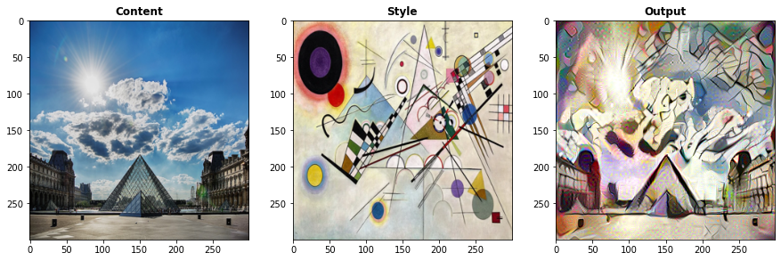
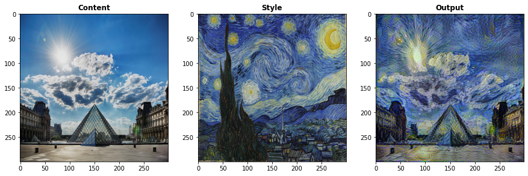
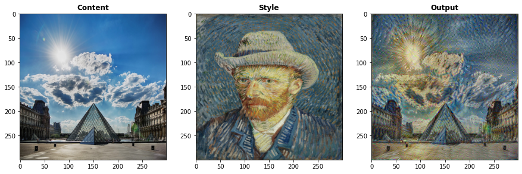
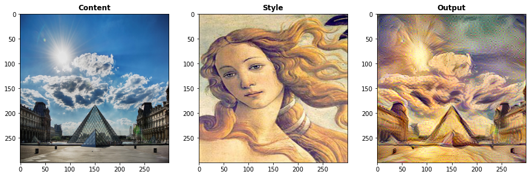
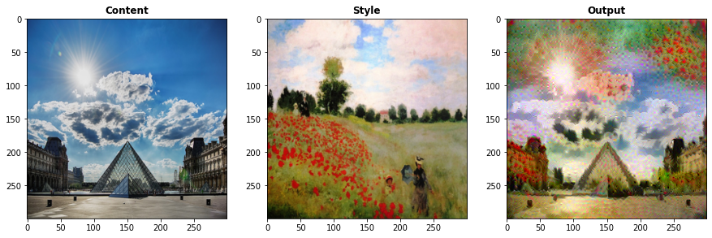
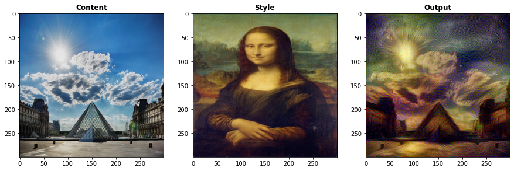
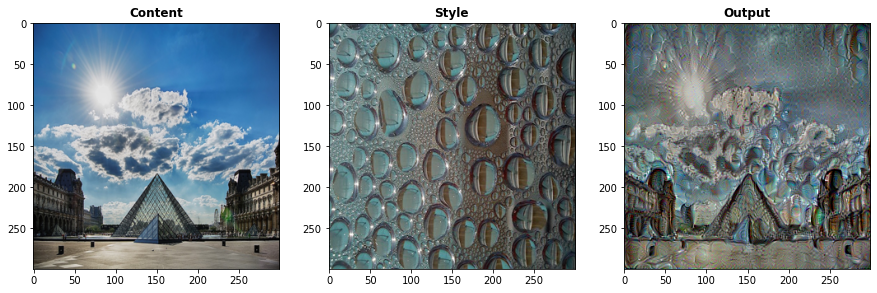
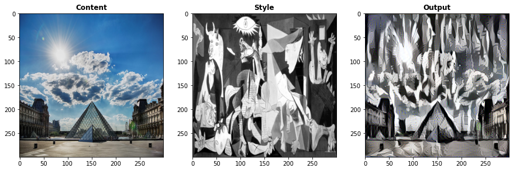

# Neural_Style_Transfer
Neural style transfer implementation in tensorflow2.0/keras

[A Neural Algorithm of Artistic Style Paper [Gatys et al. (2015)]](https://arxiv.org/abs/1508.06576)

[VGG-19-Pre-trained-model](http://www.vlfeat.org/matconvnet/models/imagenet-vgg-verydeep-19.mat)

[TensorFlow 1.0 Implementation of "A Neural Algorithm of Artistic Style"](http://www.chioka.in/tensorflow-implementation-neural-algorithm-of-artistic-style)

[How Neural Style Transfer Works? [Coursera]](https://www.coursera.org/lecture/convolutional-neural-networks/what-is-neural-style-transfer-SA5H8)

# Examples
**All examples was trained with _size=(300,300)_**

**All examples was trained with _300 epochs_ and _Adam Optimizer_ with _learning rate=10.0_**

